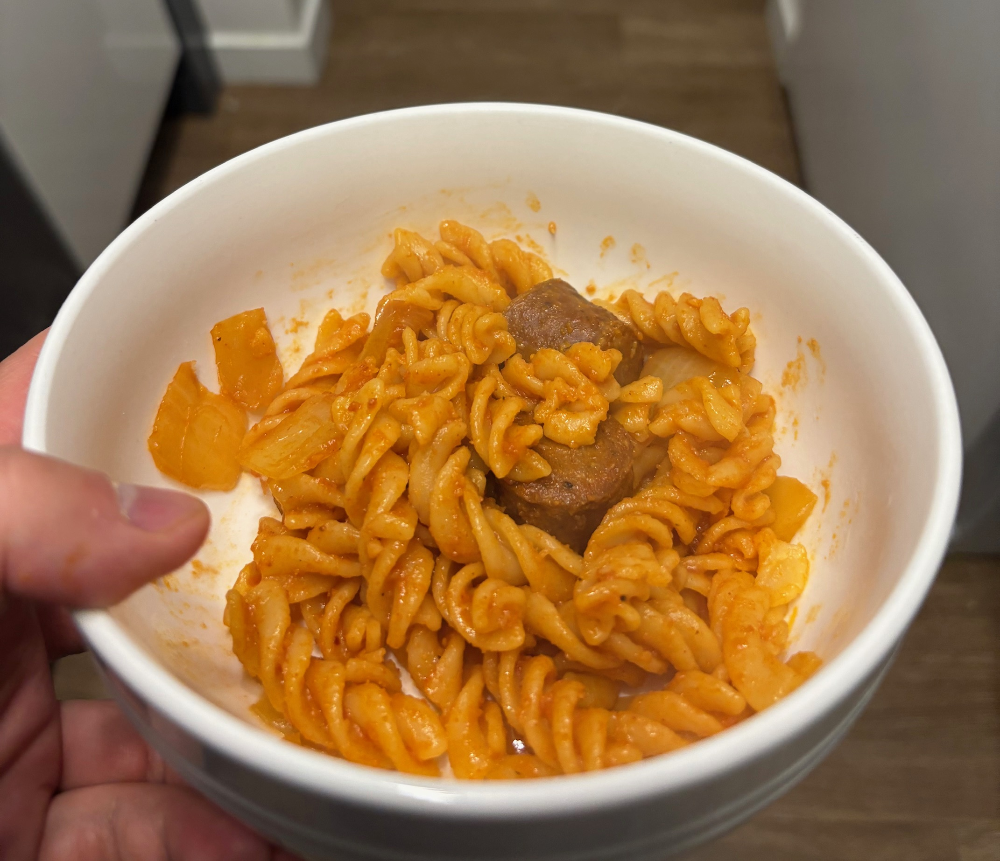

A simple and tasty pasta dish with chorizo sausage in a tomato-based sauce.

## Ingredients

- 1 lb pasta (something curly like fusilli or rotini)
- 1-2 chorizo sausage links (sliced if sleeved, crumbled if not)
- 1-2 cloves of garlic, minced
- 1/4-1/2 onion, sliced thin
- 4-5 oz tomato sauce
- 1-2 oz tomato paste
- 1 bay leaf
- paprika (to taste)
- pepper (to taste)
- salt (to taste)
- oil (for sautéing)

## Preparation

- slice/crumble the chorizo.
- mince the garlic.
- slice the onion.

## Instructions

Start the pasta before the sauce since it takes the longest.
Once the pasta and sauce are done, they will be combined.

**Pasta**

1. Start the pasta with salted water.
Depending on the method, you may want to start this during preparation.
2. Drain the pasta when done, reserving some pasta water.
Set aside.

**Chorizo Sauce**

1. Sauté the onion in a pan over medium-low heat until soft and translucent
2. Increase the heat, and add the chorizo, tomato paste, and garlic.
Keep everything moving until it's darkened a shade.
4. Add bay leaves, tomato sauce, and paprika.
Bring to boil, then reduce to a simmer.

**Combining Pasta and Sauce**

1. Over low heat, toss both pasta and sauce until combined,
about 2-4 minutes.
Use reserved pasta water as an emulsifier if needed.
2. Season with salt and pepper to taste.
