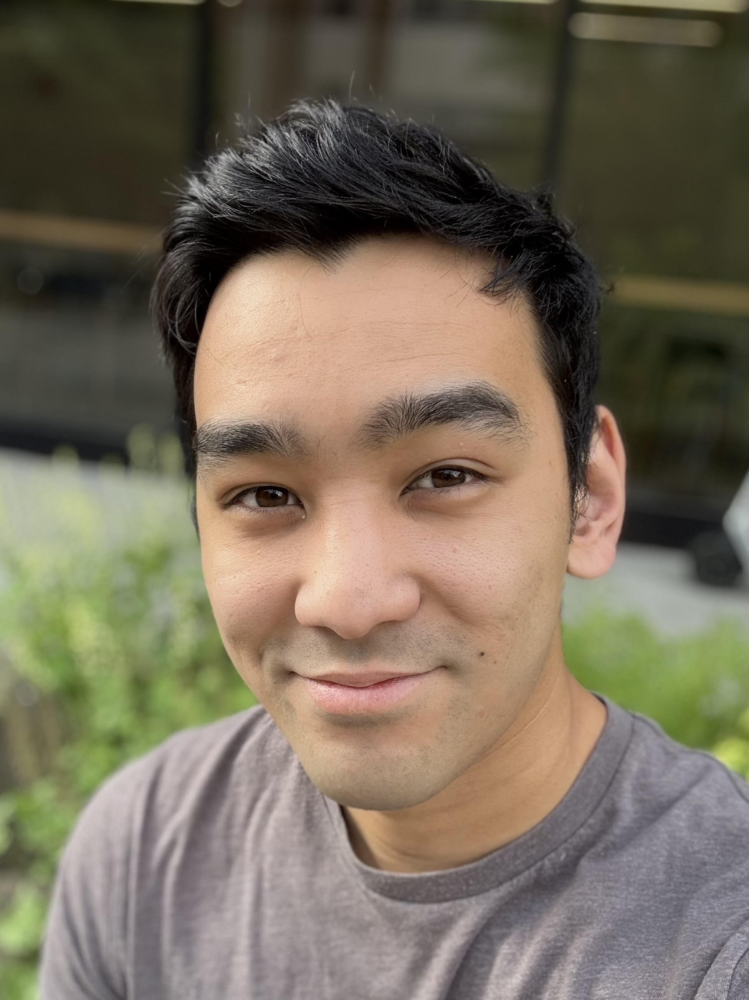

---
# Feel free to add content and custom Front Matter to this file.
# To modify the layout, see https://jekyllrb.com/docs/themes/#overriding-theme-defaults

layout: page
title: null
---

{: style="display:block; margin-left:auto; margin-right:auto; height: 300px"}

# About

My name is Brett Saiki.
I am an industrial PhD student at the University of Washington
  advised by [Zachary Tatlock](https://homes.cs.washington.edu/~ztatlock/) and
  the [Numerical Hardware Group](https://www.intel.com/content/www/us/en/developer/topic-technology/open/graphics-numerical-hardware/overview.html)
  at Intel.
I do research in programming languages, computer number systems,
  term rewriting for hardware design.

[Resume](assets/resume.pdf) -
[LinkedIn](https://linkedin.com/in/brettsaiki) -
[GitHub](https://github.com/bksaiki)

# Research

 - [Herbie](https://github.com/herbie-fp/herbie) - a tool for minimizing error
    in floating-point expressions.

 - [FPBench](https://github.com/FPBench/FPBench) - a collection of benchmarks,
    compilers, and standards for the floating-point research community.

 - [Ruler](https://github.com/uwplse/ruler) - a framework for synthesizing
    rewrite rules for a particular domain.

# Publications

**Target-Aware Implementation of Real Expressions** (Conditional)  
Brett Saiki, Jackson Brough, Jonas Regehr, Jesús Ponce, Varun Pradeep,
Aditya Akhileshwaran, Zachary Tatlock, Pavel Panchekha  
Architectural Support for Programming Languages and Operating Systems (ASPLOS) 2025

**Equality Saturation Theory Exploration à la Carte**  
Anjali Pal, Brett Saiki, Ryan Tjoa, Cynthia Richey, Amy Zhu, Oliver Flatt,
Max Willsey, Zachary Tatlock, Chandrakana Nandi  
Object-Oriented Programming, Systems, Languages and Applications (OOPSLA) 2023  
[Paper](https://ajpal.github.io/assets/files/enumo-paper.pdf)

**Odyssey: An Interactive Workbench for Expert-Driven Floating-Point Expression Rewriting**  
Edward Misback, Caleb C. Chan, Brett Saiki, Eunice Jun, Zachary Tatlock, Pavel Panchekha  
ACM Symposium on User Interface Software and Technology (UIST) 2023  
[Paper](https://arxiv.org/pdf/2305.10599.pdf)

**Rewrite Rule Inference Using Equality Saturation**  
Chandrakana Nandi, Max Willsey, Amy Zhu, Brett Saiki, Yisu Wang,
Adam Anderson, Adriana Schulz, Dan Grossman, Zachary Tatlock  
Object-Oriented Programming, Systems, Languages & Applications (OOPSLA) 2021  
_Distinguished Paper Award_  
[Paper](https://arxiv.org/pdf/2108.10436.pdf)

**Combining Precision Tuning and Rewriting**  
Brett Saiki, Oliver Flatt, Chandrakana Nandi, Pavel Panchekha, Zachary Tatlock  
IEEE Symposium on Computer Arithmetic (ARITH) 2021  
[Paper](https://herbie.uwplse.org/arith21-paper.pdf) -
[Talk](https://youtu.be/ytWhp0I8KVw)

# Side Projects

 - [Minim](https://github.com/bksaiki/Minim) - a Scheme-like language inspired by work in Racket.

 - [mpmfnum](https://github.com/bksaiki/mpmfnum-rust) - number systems library in Rust.

 - [generic-flonum](https://docs.racket-lang.org/generic-flonum/index.html) -
    Racket interface for MPFR that supports subnormal numbers and variable exponent sizes.

# Resources

 - [FPBench community](https://fpbench.org) - FPBench, FPCore, number systems, and more.
    Please start here if you want to know more about the FPBench Project.
  
 - [Herbie web demo](https://herbie.uwplse.org/demo) - an interactive page
    that runs programs through Herbie. Try it out!
